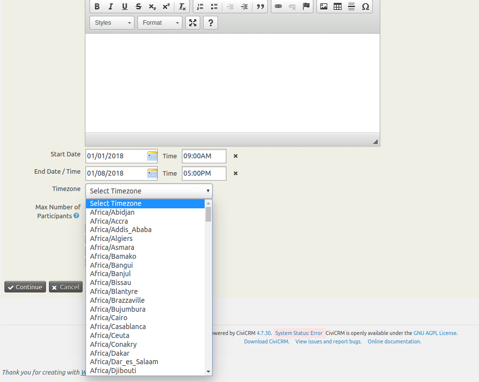

# ind.com.osseed.eventtimezone



The extension is licensed under [AGPL-3.0](LICENSE.txt).

## Requirements

* PHP v7.4+
* CiviCRM

## Installation (Web UI)

Learn more about installing CiviCRM extensions in the [CiviCRM Sysadmin Guide](https://docs.civicrm.org/sysadmin/en/latest/customize/extensions/).

## Installation (CLI, Zip)

Sysadmins and developers may download the `.zip` file for this extension and
install it with the command-line tool [cv](https://github.com/civicrm/cv).

```bash
cd <extension-dir>
cv dl ind.com.osseed.eventtimezone@https://github.com/osseed/ind.com.osseed.eventtimezone/archive/master.zip
```

## Installation (CLI, Git)

Sysadmins and developers may clone the [Git](https://en.wikipedia.org/wiki/Git) repo for this extension and
install it with the command-line tool [cv](https://github.com/civicrm/cv).

```bash
git clone https://github.com/osseed/ind.com.osseed.eventtimezone.git
cv en eventtimezone
```

## Getting Started

Event Timezone Extension allows you to add timezones in events.

## Usage

* Click Events -> New Event menu -> Timezone select list will appear under Event Date fields.

* Once event is created with timezone.  Timezone will appear on event information page, Event confirmation page and Registration completion page.
